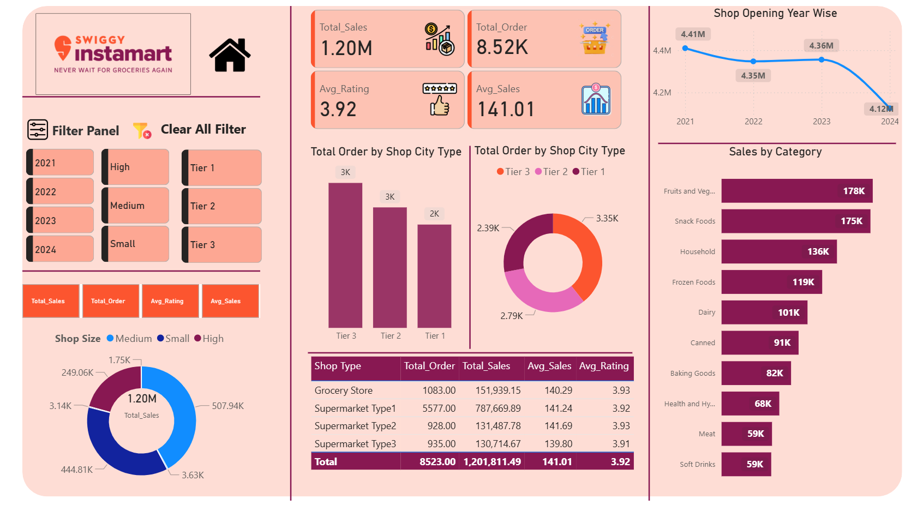

# Swiggy-Instamart-Dashboard
This project showcases a data-driven dashboard that helps in understanding the overall sales performance, customer ratings, and product category trends. The dashboard is designed for business intelligence reporting and data storytelling.

🚀 Features

Total Sales: Overall revenue generated from all items sold.

Total Orders: Count of all customer orders.

Average Sales per Order: Revenue efficiency per transaction.

Average Rating: Average customer satisfaction rating.

Shop Type & Size Analysis: Compare performance across shop types and city tiers.

Category-wise Sales Analysis: Identify top-performing categories like Fruits & Vegetables, Snack Foods, etc.

Yearly Trend Analysis: Track sales growth/decline over time.

📊 Key Insights

Tier 3 cities generated the highest orders, followed by Tier 2.

Fruits & Vegetables and Snack Foods lead the sales category.

Sales trend shows a slight decline in 2024 compared to 2021–2023.

Medium and Small shops contributed significantly to total sales.

🛠 Tools & Skills Used

Excel / Power BI (Visualization)

Data Cleaning & Transformation

KPI Development

Dashboard Design & Storytelling

Data Analytics & Business Intelligence

📂 Repository Includes

📁 Dashboard File (Power BI / Excel)

📊 Dataset (if shareable)

🖼 Screenshots of Dashboard

📝 Documentation with key insights

📸 Dashboard Preview

📌 Conclusion

This project highlights how effective data visualization can provide clear insights into business performance. It demonstrates skills in KPI analysis, dashboard design, and business intelligence storytelling.

🤝 Connect With Me

If you liked this project, let’s connect!
🔗
